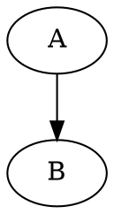

% Document
% Chad Paradis

# Introduction {-}

This is an introduction section that is not numbered.

# Section 1

This is section 1!

## Section 1.1

This is section 1.1!

# Section 2

This is section 2!

# Unordered Lists

* Item
* Item

- Item
- Item

# Numbered List

1. Item 1
   1. Item 1.1
2. Item 2
3. Item 3

# Text Emphasis

*This is text in italics!*

_This is also text in italics!_

**This is bold text!**

__This is also bold text!__

# Code

Here are some code snippets!

Here is inline code `int i = 0;`

Here is a code block:

```c
int main(void) {
	printf("test\n");

	return 0;
}
```

# Embedded Link

Here is a link to [markdown basics](https://help.github.com/articles/markdown-basics/)!

# Inline Math

Here is a reference to an example equation (@example):

(@example) $\alpha^2 + \beta^2 = \theta^2$

# Table

This is a table with columns with different justifications:

| Right | Left | Default | Center |
|------:|:-----|---------|:------:|
| 12    | 12   | 12      | 12     |
| 123   | 123  | 123     | 123    |
| 1     | 1    | 1       | 1      |

# Embedded Image

Here is an embedded image:


# Embedded Diagrams

Here are some embedded diagrams!^[This is a footnote!]

## Graphviz

An embedded Graphviz diagram!



## PlantUML

An embedded PlantUML diagram!

```{.plantuml caption="This is an diagram created by **PlantUML**!"}
@startuml
Alice -> Bob: Authentication Request Bob --> Alice: Authentication Response
Alice -> Bob: Another authentication Request Alice <-- Bob: another Response
@enduml
```

[modeline]: # ( vim: set spell spelllang=en_us: )
